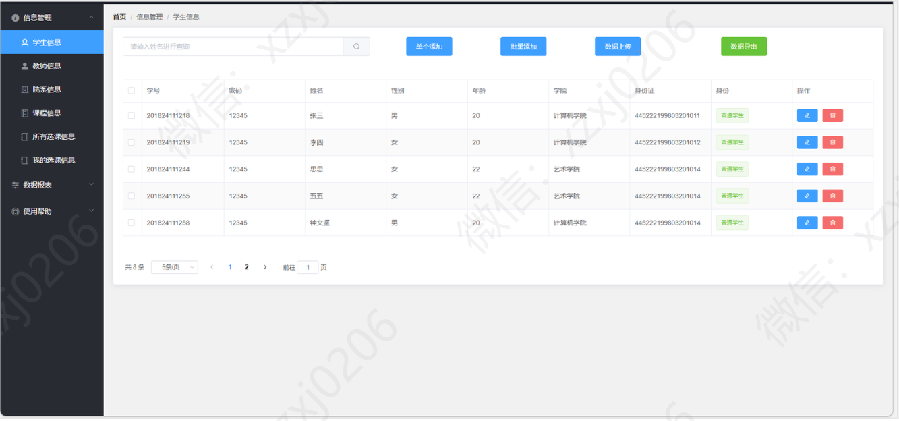

# 学生选课系统

### 有问题，或者需要协助调试运行项目的, 可以加QQ：2529519551，或者微信 ：xzxj0206 注明项目，“git+项目名称” ，如：“git学生宿舍管理系统”

### 更多项目： https://github.com/34426?tab=repositories

## 一、介绍

java学生选课系统springboot+vue学生选课系统

项目技术

后端框架：Springboot、Mybatis

前端技术：ElementUI、vue、css、JavaScript、axios

1、功能简介：系统分为用户管理员跟普通用户

管理员：   查看所有学生信息、查看所有学生信息、查看所有院系信息、查看所有课程信息、所有用户的选课信息。并对其进行增删改查，导出数据。

查看所有学生信息报表、查看所有教师信息报表、查看所有院系信息报表、查看所有课程信息报表、所有用户的选课信息报表。
修改个人信息。

普通用户： 只能查看所有教师信息、查看所有院系信息、所有用户的选课信息，无法进行修改，删除等操作。
查看所有课程信息：可以选则课程。

查看所有学生信息报表、查看所有教师信息报表、查看所有院系信息报表、查看所有课程信息报表、所有用户的选课信息报表。

## 二、系统运行界面

### 1、后端运行界面

### 2、前端运行界面

## 三、系统部分功能界面展示

